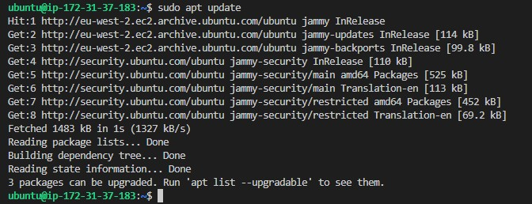
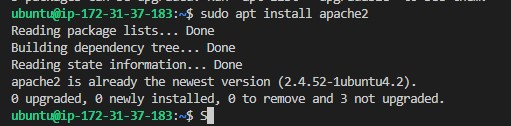
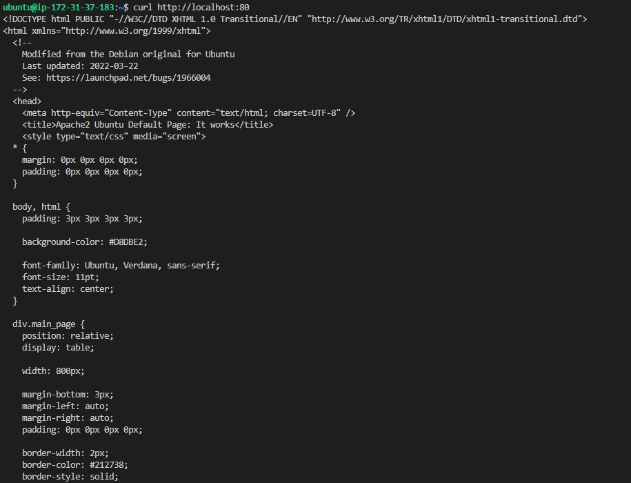
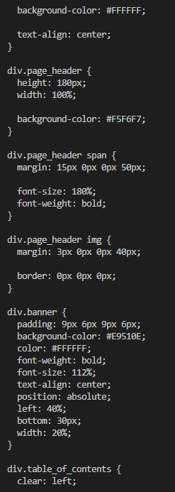
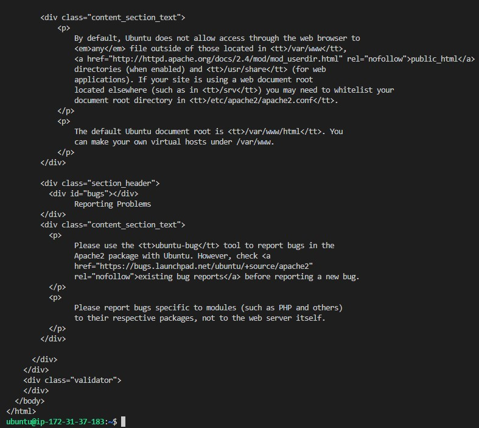

## INSTALLING APACHE AND UPDATING THE FIREWALL

## *Apache update*
`I run command 'sudo apt update' to  update the list of packages in package manager and I got the output shown in the image below:`

## *Apache2 installation*
`I run command 'sudo apt install apache2' to install apache2 package and I got the output displayed in the image below:`

## *Apache system status*
`To confirm that apache2 is running as a service in my OS, I run the command 'sudo systemctl status apache2' and I got the output shown in the image below:`

## *check apache serve locally*

`To access my apache server locally I run command 'curl http://localhost:80' and the image below was obtained from the output`

**kindly note that the images posted are the page 1, 2 and the last page of the output**

